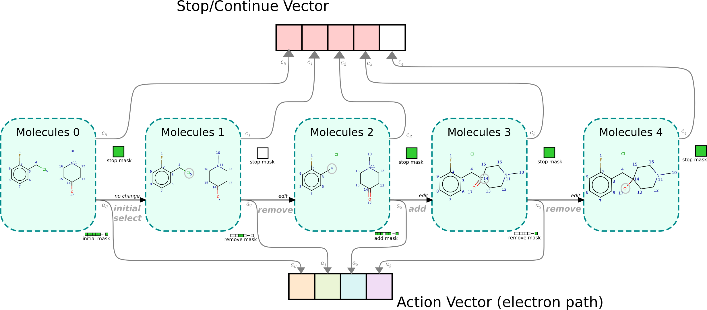

# A Generative Model For Electron Paths

Core code for the paper "A Generative Model For Electron Paths" (https://openreview.net/forum?id=r1x4BnCqKX).

## Installation

1. Install the requirements (listed in requirements.txt). We're using Python 3.6.
2. Get the submodules, i.e. `git submodule init` then `git submodule update`  
3. Unzip the data folder: `lef_uspto.zip`
4. Add the correct modules to the `PYTHONPATH`, e.g. this can be done by `source set_up.sh`

*PyTorch*  
We're using 1.0 

*PyTorch Scatter*  
Instructions for installing pytorch_scatter can be found online at: https://github.com/rusty1s/pytorch_scatter
For installation on MacOS look at:
https://github.com/rusty1s/pytorch_scatter/issues/21

*RDKit*  
 We recommend installing rdkit through Anaconda, see e.g.
https://anaconda.org/rdkit/rdkit:  
`conda install -c rdkit rdkit`

## Model Code

The model code is in `rxn_steps/model/electro_model.py`. A model gets constructed in `rxn_steps/model/get_electro.py`.

The model predicts the action at each step and whether to continue or not, shown by the grey arrows in the diagram below:

The action selection code is in `rxn_steps/model/action_selector.py` and the code computing the logits for when to stop can 
 be found at `rxn_steps.model.graph_models.GraphAggregator`.

### Training Models

ELECTRO can be trained using the script `scripts/train_electro/train_electro.py`.
Note that we are not using quite the same training setup as reported in the paper. 
This repo can train mini-batches of reactions  with size greater than one. 

## Demo Jupyter Notebooks
Examples of ELECTRO-LITE making predictions can be found in:
* `notebooks/mechanism_prediction.ipynb`: Showing the approximate mechanisms predicted by drawing an arrow-pushing diagram.
* `notebooks/next_action_prediction.ipynb`: Showing the probabilities the model assigns to each action at each stage.

### Dockerfile
These notebooks can also be run using Docker if you prefer. 
The Docker image can be built using eg `docker build . -t rxn-steps`.
It can then be run by `docker run -it --rm -p 8080:8080 rxn-steps`
